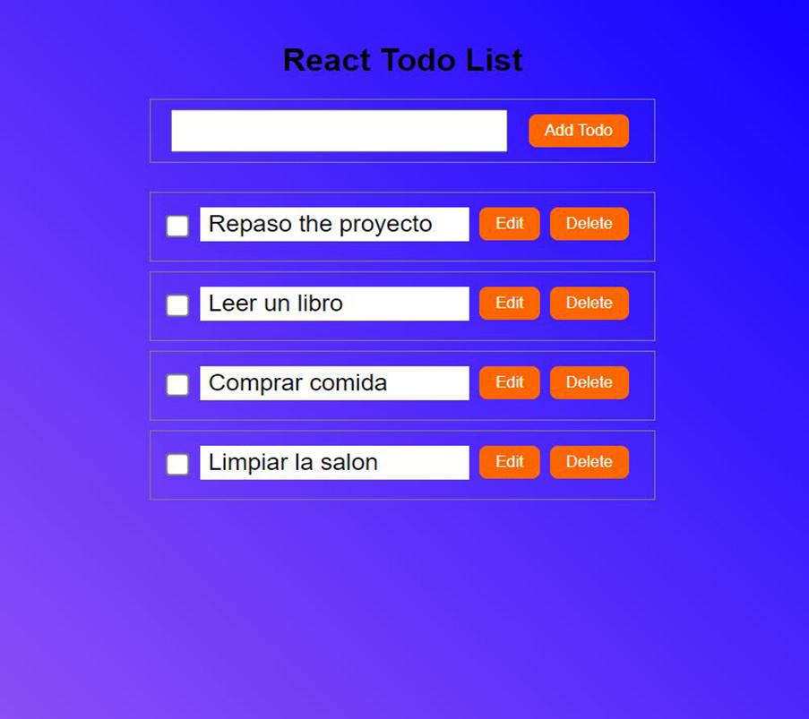

## React Todo List App


### Una sencilla aplicación React que te permite gestionar tus tareas diarias. Puedes añadir, editar, borrar y ver tus tareas cómodamente.

## Características

Añade nuevas tareas a tu lista.
Editar las tareas existentes.
Eliminar tareas cuando se hayan completado o ya no sean necesarias.
Visualizar la lista de tareas de un vistazo.

## Installación
```
npm create vite@latest project-name
cd project-name

npm install
```
## Utilización
Iniciar  el servidor developmente:
```
npm run dev
```
